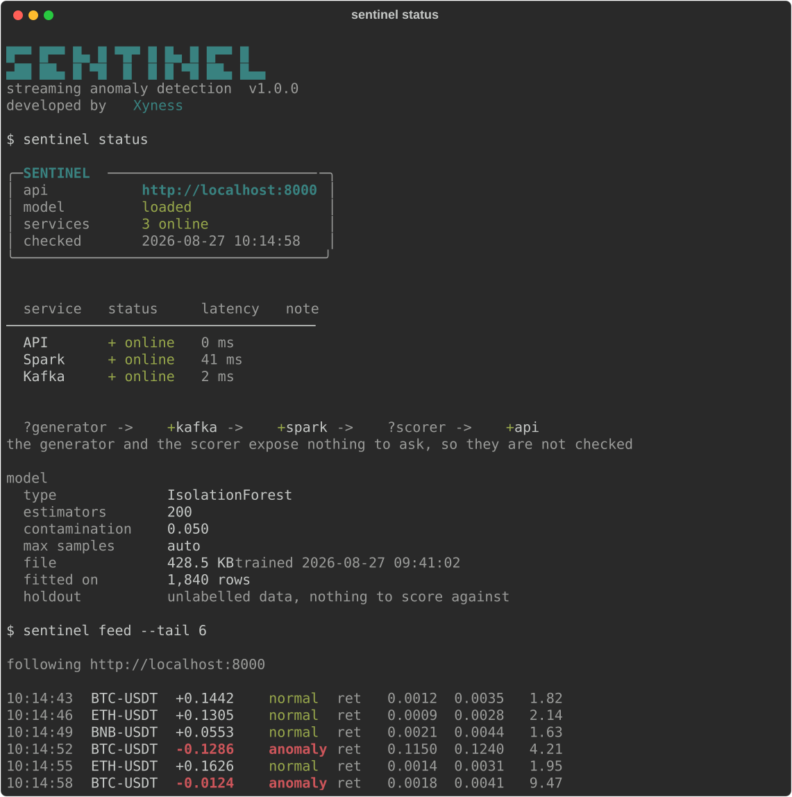

# Sentinel

[](https://github.com/Xyness/Sentinel/actions/workflows/ci.yml)

Streaming anomaly detection on crypto markets. Kafka carries the trades, Spark turns them into
rolling features, an Isolation Forest decides what looks wrong, and a terminal client shows you
what it flagged.

It runs on either a simulator with anomalies injected on purpose (useful because you know the
ground truth) or on live Binance trades over their public WebSocket.



## Getting it up

Docker and Docker Compose for the pipeline, Python 3.11+ for the client.

```bash
docker compose up --build
pip install -e ./cli
```

For real market data instead of the simulator:

```bash
DATA_SOURCE=binance docker compose up --build
```

Give it two or three minutes on first start. Nothing is broken during that time: Spark has to
accumulate enough windows to write features, the training job waits for those files to show up,
and the API only picks up a model once training finishes. `sentinel status` says where it has
got to, and `docker compose logs -f` if you want the detail.

Then: API on [8000](http://localhost:8000) (`/docs` for Swagger), Spark UI on
[4040](http://localhost:4040). `docker compose down -v` when you're done and want the volumes
gone too.

## The pipeline

```
   generator --> Kafka --> Spark Streaming --> Parquet --> training --> model
  (sim or                  rolling stats,     partitioned  Isolation    .joblib
   Binance)                z-scores           by symbol    Forest          |
                                                  |                        |
                                                  +--> scorer --> API <----+
                                                                   |
                                                                   +--> sentinel
                                                                        terminal
```

**Generating.** The simulator produces BTC/ETH/BNB against USDT with configurable rates of price
spikes, volume spikes and flash crashes, labelling each event so you can measure yourself
afterwards. The Binance connector streams real trades and needs no API key. Both emit the same
shape:

```json
{
  "timestamp": 1710000000,
  "symbol": "BTC-USDT",
  "price": 43150.50,
  "volume": 12.534210,
  "log_return": 0.003521,
  "is_anomaly": false,
  "anomaly_type": null
}
```

**Spark.** Structured Streaming reads the topic and computes rolling mean and standard deviation
for price, log return and volume over one-minute tumbling windows, then z-scores off those.
Where the standard deviation is zero the z-score returns 0 rather than a NaN: a flat minute
isn't an anomaly, and a NaN poisons everything downstream. Output is Parquet partitioned by
symbol.

**Training.** Isolation Forest, 200 estimators, 1% contamination, over the five z-score and
volatility features with a StandardScaler in front. On simulated data there's an 80/20 split and
a classification report, since the labels exist. On real data it's fully unsupervised, because
there's nothing to score against.

**Scoring.** The training job produces a model, but something has to put live rows through it.
The scorer reads each Parquet file Spark closes, pulls the five features out and posts one vector
per row to `/predict`. Three symbols on one-minute windows is three predictions a minute, which
is why it polls rather than watches.

**Serving.** FastAPI comes up immediately and loads the model lazily, so the API is reachable
while training is still running and reports `model: not loaded` rather than refusing to start.
While it says that, the scorer holds onto the files it could not send instead of dropping them.

```bash
curl http://localhost:8000/health
curl http://localhost:8000/stats
curl http://localhost:8000/model-info
curl "http://localhost:8000/latest-predictions?limit=50&symbol=BTC-USDT"

curl -X POST http://localhost:8000/predict \
  -H "Content-Type: application/json" \
  -d '{"symbol":"BTC-USDT","z_score_price":4.5,"z_score_log_return":3.8,
       "z_score_volume":1.5,"rolling_price_std":0.008,"rolling_volume_std":25}'
```

`/system-status` reports on the other services too, which is what `sentinel status` prints.

## The client

`sentinel` talks to the API over HTTP and to nothing else, so it runs from your machine against
the compose stack, or against an API anywhere else with `--api`.

```bash
sentinel status                                # what is up, and what the model looks like
sentinel status --details                      # and the scaler the model was fitted with

sentinel feed                                  # follow predictions as they land
sentinel feed --symbol BTC-USDT --anomalies    # one pair, only the flagged ones
sentinel feed --once --tail 50                 # the last 50, then stop

sentinel stats                                 # the buffer, aggregated
sentinel stats --symbol ETH-USDT

sentinel predict --preset flash-crash          # score a feature vector by hand
sentinel predict --preset normal --z-volume 4.8

sentinel export -f csv -o predictions.csv
```

**status** draws the services with their latency, the pipeline with a mark on each stage, and the
model that is loaded. The generator and the scorer answer on nothing, so they are drawn unchecked
rather than green: a stage nobody looked at is not a stage that is up.

**feed** is a tail. One prediction per line, columns wide enough to stay aligned, anomalies the
only thing coloured, so it goes through `grep` and `awk` like anything else. Ctrl-C stops it and
prints what went past.

**stats** is the retrospective view: the per-symbol breakdown, the score trend as a sparkline,
the percentile spread and the feature table.

**predict** is the manual test, with the same four presets the dashboard had (`normal`,
`price-spike`, `volume-spike`, `flash-crash`). Any flag overrides the preset it started from, and
a vector with holes in it is an error rather than a set of zeros the model would happily score.

`--json` on any of them prints the raw payload instead of the rendered view:

```bash
sentinel stats --json | jq '.per_symbol'
sentinel feed --json | jq -c 'select(.is_anomaly)'
```

### Where the predictions come from

The scorer, on its own, at roughly three a minute. You can also push vectors in by hand, one at a
time or as a stream on stdin, which is what the presets are for:

```bash
jq -c '.[]' vectors.json | sentinel predict --stdin
```

The buffer holds the last 500 either way, and it lives in the API process, so restarting the API
empties it.

### In a pipeline

```bash
sentinel predict --preset flash-crash --fail-on-anomaly --json
```

Exit codes: `0` fine, `1` error, `2` something was flagged, `130` interrupted. Output is plain
and uncoloured whenever it is not going to a terminal, and `--plain` forces that anywhere.

## Configuration

Environment variables, all with defaults that work under Compose:

| Variable | Default | |
|---|---|---|
| `DATA_SOURCE` | `simulated` | or `binance` |
| `KAFKA_BOOTSTRAP_SERVERS` | `localhost:9092` | |
| `KAFKA_TOPIC` | `crypto-market` | |
| `EVENT_FREQUENCY_SECONDS` | `1` | simulator only |
| `ANOMALY_PROBABILITY` | `0.01` | simulator only |
| `MIN_PARQUET_FILES` | `3` | how much data before training starts |
| `MAX_WAIT_SECONDS` | `600` | give up waiting for it |
| `MODEL_PATH` / `FEATURES_PATH` | | where the model and features live |
| `API_BASE_URL` | `http://localhost:8000` | where the client and the scorer look for the API |
| `SCORE_INTERVAL_SECONDS` | `15` | how often the scorer looks for new feature files |

Seven services come up: Zookeeper and Kafka, the generator, Spark, the training job (which exits
once it's done), the API and the scorer. They share three volumes: features written by Spark and
read by both training and the scorer, Spark's checkpoints, and the model written by training and
read by the API. The client is not one of them: it is a `pip install` on your machine that talks
to port 8000.

## Tests

```bash
pip install -r tests/requirements.txt
pytest
```

Covers the simulator's event structure and log returns, the Binance connector's symbol mapping
and message parsing, preprocessing (NaN handling, labelled and unlabelled paths), the API schemas
and endpoints, config defaults and overrides, the scorer and the terminal client. All of it
offline: the scorer's tests write real Parquet into a temp directory and the client's stand the
API up in-process behind an `httpx` mock transport, so nothing binds a port.

## Layout

`data-generator/` produces events, `spark-java/` is the Maven-built streaming job, `ml-python/`
trains and evaluates, `api/` serves predictions, `scorer/` feeds it the rows Spark wrote, `cli/`
is the terminal client, `docker/` holds the Dockerfiles and `tests/` the pytest suite.
`scripts/demo.py` regenerates the capture at the top of this file.

There's more detail in [`docs/report.md`](docs/report.md), and
[`docs/choices-en.md`](docs/choices-en.md) explains why things were built the way they were.
Worth reading if you're wondering why Isolation Forest rather than something supervised.
